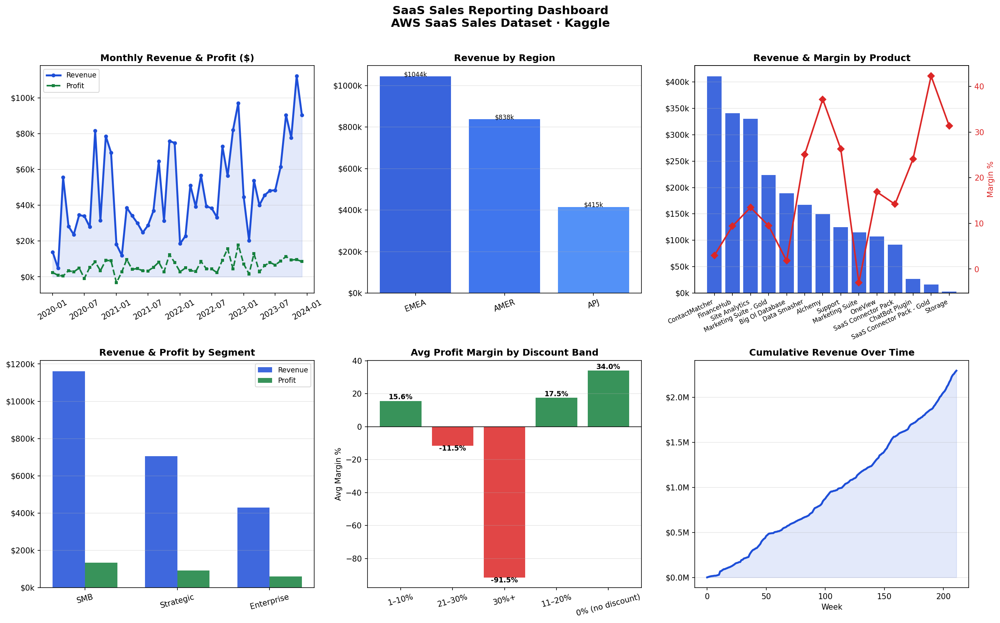

# SaaS Sales Reporting Dashboard

Built this to get some real practice with SQL window functions — `LAG()`, `RANK() OVER()`, running totals — on an actual dataset. Found the AWS SaaS Sales dataset on Kaggle and it turned out to be a decent size with enough variety across regions, products, and customer segments to make the analysis interesting.



## Dataset

**AWS SaaS Sales** from Kaggle — real SaaS product transaction data.  
Download: https://www.kaggle.com/datasets/nnthanh101/aws-saas-sales  
Drop `SaaS-Sales.csv` in the project root before running.

| Column | Description |
|---|---|
| `Order ID` | Unique order identifier |
| `Order Date` | Date of transaction |
| `Customer` | Customer company name |
| `Country / Region / Subregion` | Geographic breakdown |
| `Industry` | Customer's industry vertical |
| `Segment` | SMB, Mid-Market, or Enterprise |
| `Product` | SaaS product purchased |
| `Sales` | Revenue in USD |
| `Quantity` | Units ordered |
| `Discount` | Discount applied (0–1) |
| `Profit` | Profit after costs and discounts |

## What it does

Six analyses, each as a SQL query (PostgreSQL flavour in `queries.sql`, SQLite in `analysis.py`):

1. **Weekly revenue** — WoW growth with `LAG()` and a cumulative total using a running window sum
2. **Regional breakdown** — revenue and margin per region, ranked with `RANK() OVER()`
3. **Product performance** — which products actually make money vs. just drive volume
4. **Customer segments** — SMB vs Mid-Market vs Enterprise; revenue per customer differs a lot more than I expected
5. **Discount impact** — bucketed by discount depth; anything above 30% off tends to go margin-negative
6. **Top 15 customers** — lifetime revenue with window-function ranking

## How to run

```bash
pip3 install -r requirements.txt
python3 analysis.py
```

Outputs:
- `saas_analysis.png` — 6-panel chart
- `saas_sales_report.xlsx` — 7-sheet formatted Excel report

No PostgreSQL needed — the script runs everything through in-memory SQLite. The `.sql` file has the proper PostgreSQL versions if you want to run them against a real database.

## Excel report sheets

| Sheet | Contents |
|---|---|
| Cover | Table of contents |
| Weekly Revenue | Week-by-week figures with WoW growth and a line chart |
| Region Analysis | Revenue and margin by region |
| Product Analysis | Product-level revenue, profit, discount, margin |
| Segment Analysis | SMB / Mid-Market / Enterprise breakdown |
| Discount Impact | Margin by discount band |
| Top Customers | Top 15 customers by lifetime revenue |

## Stack

Python · pandas · SQLite · openpyxl · Matplotlib · PostgreSQL (queries only)
